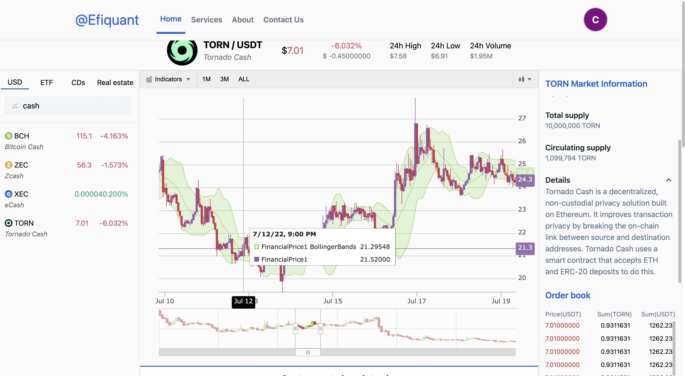
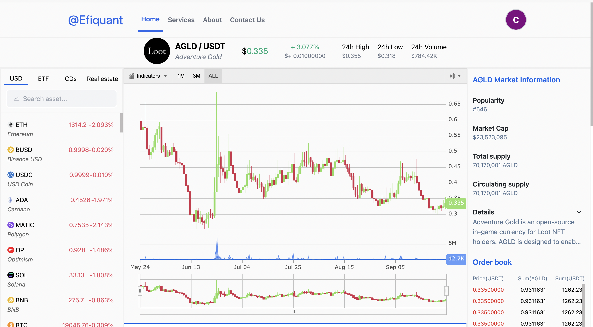
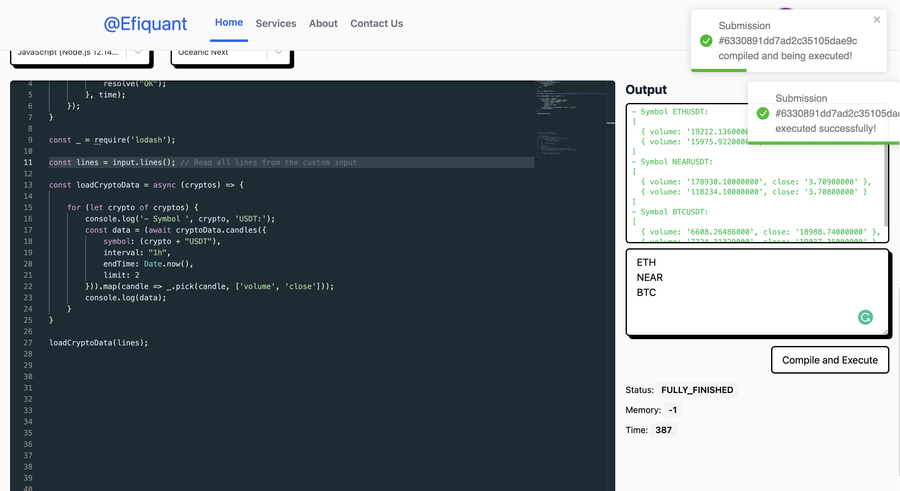

# Efiquant

<!--- These are examples. See https://shields.io for others or to customize this set of shields. You might want to include dependencies, project status and licence info here --->


<!--  -->

Efiquant is an online algorithmic trading platform that helps users to build algorithmic crypto trading strategy in the easiest way with built-in code editor, provided crypto APIs, real time crypto market data and charts.

## Author

This project belongs to @[me](https://github.com/galin-chung-nguyen). 

## Technology stack
- Front-end: NextJS, Redux, TailwindCSS
- Back-end: NestJS, MongoDB, Prisma, GraphQL

## Live demo

A public demo will be released soon.

#### Login


#### Sign up


#### Crypto charts




#### Build an algorithmic trading strategy with online code editor



## Installing Efiquant

To install Efiquant, use this command:

```
npm install

or

yarn install
```
## Using Efiquant

To run Efiquant, use this command:

```
npm run dev/ npm run start

or 

yarn dev/ yarn start
```

## Contributing to Efiquant
To contribute to Efiquant, follow these steps:

1. Fork this repository.
2. Create a branch: `git checkout -b <branch_name>`.
3. Make your changes and commit them: `git commit -m '<commit_message>'`
4. Push to the original branch: `git push origin Efiquant/<location>`
5. Create the pull request.

Alternatively see the GitHub documentation on [creating a pull request](https://help.github.com/en/github/collaborating-with-issues-and-pull-requests/creating-a-pull-request).

<!-- ## Contributors

Thanks to the following people who have contributed to this project:

* [@scottydocs](https://github.com/scottydocs) 📖
* [@cainwatson](https://github.com/cainwatson) 🐛
* [@calchuchesta](https://github.com/calchuchesta) 🐛

You might want to consider using something like the [All Contributors](https://github.com/all-contributors/all-contributors) specification and its [emoji key](https://allcontributors.org/docs/en/emoji-key). -->

## Contact

If you want to contact me you can reach me at [Linkedin](https://www.linkedin.com/in/galin-chung-nguyen/).

### **Have a good day!**